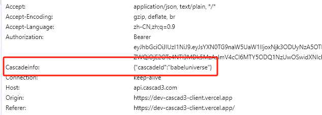
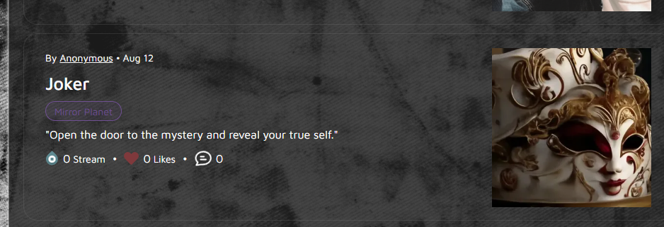

# Note
Before calling the Endpoint, you need to create a cascade（https://www.cascad3.com/） and get the cascadeId, and set it in the request header

Cascadeinfo：{"cascadeId":"cascadeIdValue"}

like this：



## baseUrl：https://apiv2.cascad3.com/cascad3-client

## 1、Pagination data of pieces
#### Endpoint 
GET /client/cascade/home/pageHomePieces

### Request parameters

| name      |  type    | Required | Description                          |
|-----------|---------|------|--------------------------------------|
| keyword   |  string  | no   | search keyword                       |
| pageIndex |  integer | no    | Current page number                  |
| pageSize  |  integer | no    | Number of records displayed per page |
| tagId     |  integer | no    | tag id                               |
| createBy  |  integer | no    | 作者Id                                 |
| sortBy    | integer | no    | Sort type: 0: Created time descending (default), 1: Number of likes,2: Number of comments,3: Number of reads,4: Number of downStreams,5: Amount of rewards |

### Response：
```json
{
    "data": {
        "data": [
            {
                "arId": "string",              
                "authorFaceUrl": "string",
                "authorUsername": "string",
                "commentCount": 0,
                "coverUrl": "string",
                "createBy": 0,
                "createByAddress": "string",
                "createTime": "2019-08-24T14:15:22Z",
                "downstreamCount": 0,
                "featured": true,
                "id": 0,
                "likeCount": 0,
                "rewardAmount": 0,
                "subTitle": "string",
                "tagInfos": [
                    {
                        "id": 0,
                        "tag": "string",
                        "tagColor": "string"
                    }
                ],
                "title": "string",
                "uuid": "string"
            }
        ],
        "pageCount": 0,
        "pageIndex": 0,
        "pageSize": 0,
        "totalRecords": 0
    },
    "msg": "string",
    "status": 0
}
```



## 2、Piece detail
#### Endpoint
GET /client/cascade/home/pieceInfo

### Request parameters
| name      |  type    | Required | Description |
|-----------|---------|------|-----------|
|pieceUuid|string| yes |pieceUuid|

### Response：
```json
{
  "data": {
    "arId": "string",
    "author": {
      "bio": "string",
      "dailyStreamArId": "string",
      "email": "string",
      "faceUrl": "string",
      "id": 0,
      "inStream": 0,
      "outStream": 0,
      "tokenAmount": 0,
      "username": "string",
      "walletAddress": "string"
    },
    "authorFaceUrl": "string",
    "authorUsername": "string",
    "commentCount": 0,
    "content": "string",
    "coverUrl": "string",
    "createBy": 0,
    "createByAddress": "string",
    "createTime": "2019-08-24T14:15:22Z",
    "currState": 0,
    "downstreamCount": 0,
    "featured": true,
    "id": 0,
    "isLike": true,
    "likeCount": 0,
    "pieceEditorId": 0,
    "ratio": 0,
    "readCount": 0,
    "rewardAmount": 0,
    "subTitle": "string",
    "tagInfos": [
      {
        "id": 0,
        "tag": "string",
        "tagColor": "string"
      }
    ],
    "title": "string",
    "uuid": "string"
  },
  "msg": "string",
  "status": 0
}

```

## 3、tag列表
#### Endpoint
GET /client/cascade/home/tags

### Response：
```json
{
	"data": [
		{
			"id": 0,
			"tag": "",
			"tagColor": ""
		}
	],
	"msg": "",
	"status": 0
}
```
## 4、置顶（TOP）文章
#### Endpoint
GET /client/cascade/home/cascadeFeatureList
### Response：
```json
{
  "data": [
    {
      "arId": "",
      "authorFaceUrl": "",
      "authorUsername": "",
      "coverUrl": "",
      "createBy": 0,
      "createByAddress": "",
      "createTime": "",
      "downstreamCount": 0,
      "featured": true,
      "id": 0,
      "subTitle": "",
      "tagInfos": [
        {
          "id": 0,
          "tag": "",
          "tagColor": ""
        }
      ],
      "title": "",
      "uuid": ""
    }
  ],
  "msg": "",
  "status": 0
}
```

## 补充说明

针对这些需求的说明：categories、tag、作者、类似文章、最新文章、置顶（TOP）文章、搜索功能、语言切换

categories，类似文章和语言切换，我们当前没有这个功能

tag：列表见3号接口

作者：在详情里面有体现

最新文章：1号接口默认是按照时间倒序的（sortBy）

置顶（TOP）文章：见4号接口

搜索功能：1号接口有一个入参：keyword，针对标题进行模糊搜索


